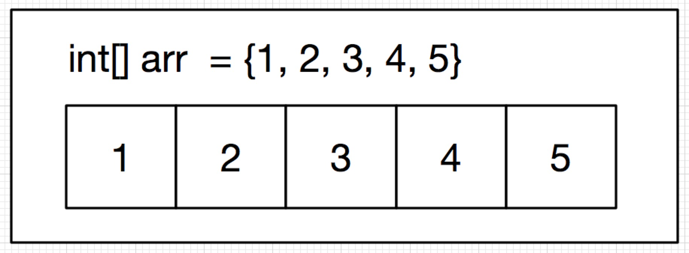
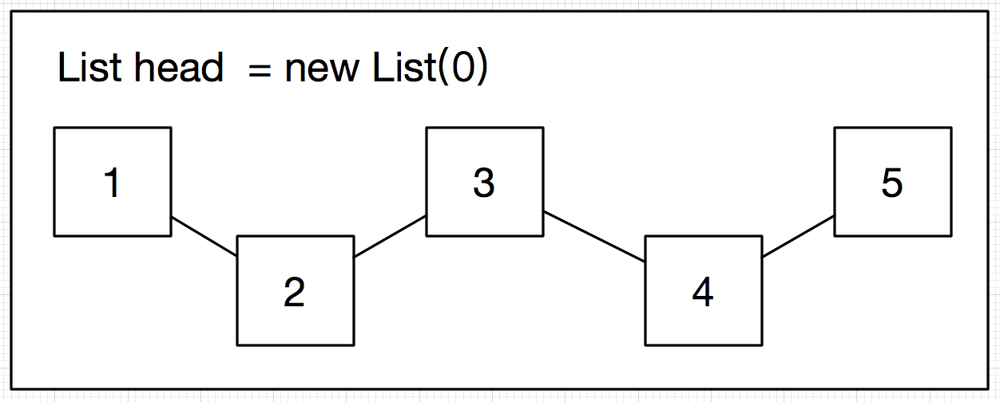

>线性表是指由多个相同类型的元素组成的有限序列，主要包括数组和链表。链表实现的部分代码详见[Github](https://github.com/BLYang7/DataStructure/blob/master/List.java)

### 数组
数组中有确定的上界和下界，元素在数组中是连续存放的。如下：<br>
<br>
数组中的数据是连续的，所以它们的访问速度很快。但使用的时候必须给定数组的长度，使得可以给它分配内存。一旦数组长度确定，就不能再改变了。

### 单向链表
链表是线性表的另一种实现。每个元素都是一个节点，如下：<br/>
<br/>
链表中的元素在物理地址上的存储是分散的，便于插入和删除。但是访问的速度会变慢，这是因为访问任意一个节点时，都要从节点首部开始寻找。

### 链表的实现
这里主要实现一下链表的创建、节点的插入、节点删除、节点删除等操作
##### 链表定义
链表的定义主要包括初始化、元素值和下一个节点的链接

```
	private static class ListNode{  
        public int element;  
        public ListNode next;  
        public ListNode(int element){  
            this.element = element;  
        }  
    }
```

#### 链表的其它操作
当链表初始化结束之后，就要开始实现一些基本的判断逻辑，比如说判断是否为尾节点，链表是否为空等

``` 
	/**
	 * 判断链表是否为空
	 * @param head 链表头节点
	 * @return 
	 */
	private boolean isEmpty(ListNode head){
		return head.next == null;
	}
	
	/**
	 * 判断是否是尾节点
	 * @param node 待判断节点
	 * @return
	 */
	private boolean isLast(ListNode node){
		return node.next == null;
	}
```
链表的增删改查同样需要实现，这里主要讲增删查，改的操作只需要给链表节点重新赋值就可以了。

``` 
	/**
	 * 链表元素查找
	 * @param element 待查找的元素
	 * @param head 待查找的链表首部
	 * @return 链表中符合查找条件的节点
	 */
	private ArrayList<ListNode> find(int element, ListNode head){
		ArrayList<ListNode> list = new ArrayList<ListNode>();
		while( head != null ){
			if( head.element == element ){
				list.add(head);
			}
			head = head.next;
		}
		return list;
	}
	
	/**
	 * 链表元素的删除
	 * @param element 链表中的元素
	 * @param head 链表首部
	 * @return 删除后的链表首部
	 */
	private ListNode delete(int element, ListNode head){
		ListNode temp = new ListNode(0);
		temp.next = head;
		head = temp.next;
		while(temp.next != null ){
			if( temp.next.element == element ){
				temp.next = temp.next.next;
			}
			temp = temp.next;
		}
		return head;
	}
	
	
	/**
	 * 链表节点的插入
	 * @param element 待插入的元素
	 * @param position 带插入的位置
	 */
	private void insert(int element, ListNode position){
		ListNode temp = new ListNode(element);
		temp.next = position.next;
		position.next = temp;
	}
``` 
#### 线性表中涉及的算法
线性表基本构造结束，可以考虑线性表中其它的一些算法。这些算法包括

* 链表的冒泡排序
* 两个有序链表的合并
* 链表的反转
* 获取链表的最后四个值
* 获取链表的中间节点
* 交换链表中任一两个元素
* 两个链表相加
* 链表的逆序打印
* 链表相乘

这些操作等具体实现如下：

```
	/**
	 * 链表的冒泡排序
	 * 外层循环实现冒泡的此数
	 * 每层循环实现个轮询内的向上冒泡
	 * @param head 待排序链表首部
	 * @return 排序之后的链表首部
	 */
	private ListNode bubbleSort(ListNode head){
		ListNode pre1,pre2;
		int temp;
		for( pre1 = head; pre1.next != null; pre1 = pre1.next){
			for(pre2 = head; pre2.next != null; pre2 = pre2.next){
				if(pre2.element > pre2.next.element){
					temp = pre2.element;
					pre2.element = pre2.next.element;
					pre2.next.element = temp;
				}
			}
		}
		return head;
	}
	
	
	/**
	 * 两个有序单链表的合并
	 * @param head1 第一个有序单链表的首部
	 * @param head2 第二个有序单链表的首部
	 * @return 合并之后的链表
	 */
	private ListNode Merge(ListNode head1, ListNode head2){
		ListNode head = new ListNode(-1);  //记录下首部
		ListNode pre = head;  //用来做迭代用
		ListNode curr;  //临时变量
		
		ListNode curr1 = head1;
		ListNode curr2 = head2;
		
		//比较链表，较小的添加到新的链表里
		//如果两个值同样大，则合并为一个
		while( curr1 != null && curr2 != null){
			
			if( curr1.element < curr2.element ){
				curr = new ListNode( curr1.element );
				curr1 = curr1.next;
			} else if(curr1.element > curr2.element) {
				curr = new ListNode( curr2.element );
				curr2 = curr2.next;
			} else {
				curr = new ListNode(curr1.element);
				curr1 = curr1.next;
				curr2 = curr2.next;
			}
			pre.next = curr;
			pre = pre.next;
		}
		
		if( curr1 != null ){
			pre.next = curr1;
		} else if( curr2 != null ){
			pre.next = curr2;
		}
		return head.next;
	}
	
	
	/**
	 * 链表的反转,使用递归来实现
	 * @param head 待反转的链表的首部
	 * @return 反转之后的链表首部
	 */
	private ListNode reverseListNode(ListNode head){
		if( head.next == null ){
			return head;
		}
		ListNode temp = reverseListNode(head.next);
		head.next.next = head;
		head.next = null;
		return temp;
	}
	
	
	
	/**
	 * 获取链表的最后四个
	 * 方法一：两个链表指针
	 * 先让第一个走四次，然后让两个同时走
	 * 当第一个走到底的时候，第二个则走到了倒数第四个
	 * 返回第二个
	 */
	private ListNode getLastFour(ListNode head){
		ListNode A = head;
		ListNode B = head;
		
		for(int i=0; i<4; i++){
			if(A.next == null){
				System.out.println("length less than 4");
			}
			A = A.next;
		}
		
		while( A != null){
			A = A.next;
			B = B.next;
		}
		
		return B;
	}
	
	/**
	 * 获取链表的最后四个
	 * 方法二：数组方法
	 * 做一个长度为四的数组arr，分别存储4N，4N＋1， 4N＋2， 4N＋3的链表节点
	 * 遍历这个链表，得到最后一个元素arr[i]， 则arr[(i+1)%4]即为倒数第四个元素
	 * @throws Exception 
	 */
	private ListNode getLastFourthFun(ListNode head) throws Exception {
		ListNode curr = head;
		int i=0;
		ListNode[] arr = new ListNode[4];
		while( curr.next != null ){
			arr[i] = curr.next;
			curr = curr.next;
			i = (i+1)%4;
		}
		
		if( arr[i] == null ){
			throw new Exception("length less than 4 ");
		}
		return arr[i];
	}
	
	
	
	/**
	 * 获取链表的中间节点
	 * 使用两个指针，指针一每次走一步，指针二每次走两步
	 * 这里涉及到一个奇偶性的问题，偶数的时候输出中间两个，奇数的时候输出中间一个
	 */
	private ListNode getMiddleOne(ListNode head, Boolean[] isOdd){
		ListNode A = head;
		ListNode B = head;
		while( B != null && B.next != null && B.next.next != null ){
			A = A.next;
			B = B.next.next;
		}
		
		if( B.next != null ){
			isOdd[0] = true;
		} else {
			isOdd[0] = false;
		}
		
		return A;
	}
	
	
	/**
	 * 交换一个链表中的任意两个节点
	 * @param head 链表头
	 * @param node1 第一个节点
	 * @param node2 第二个节点
	 */
	private ListNode switchNode(ListNode head, ListNode node1, ListNode node2 ){
		if( node1 == node2 || node1.element == node2.element ){
			return head;
		}
		
		ListNode curr = head;
		
		ListNode curr1 = node1;
		ListNode curr2 = node2;
		ListNode pre1 = null;
		ListNode pre2 = null;
		ListNode curr2Next = null;
		
		while( curr != null ){
			if (curr.next == node1 ){
				pre1 = curr;
				curr1 = pre1.next;
			} else if (curr.next == node2) {
				pre2 = curr;
				curr2 = pre2.next;
				curr2Next = curr2.next;
			}
			curr = curr.next;
		}
		
		pre1.next = curr2;
		curr2.next = curr1.next;
		pre2.next = curr1;
		curr1.next = curr2Next;
		
		return head;
	}
	
	
    /**
     * 两个链表相加
     * @param l1 链表1
     * @param l2 链表2
     * @return 相加之后的链表
     */
    public ListNode addTwoNumbers(ListNode l1, ListNode l2) {
        return helpler(l1, l2, 0);
    }
    //链表相加帮助类
    public static ListNode helpler(ListNode l1, ListNode l2, int k){
        if(l1 == null && l2 == null){
            return k == 0 ? null : new ListNode(k);
        }
        if(l1 == null && l2  != null){
            l1 = new ListNode(0);
        }
        if(l1 != null && l2 == null){
            l2 = new ListNode(0);
        }
        int sum = l1.element + l2.element + k;
        ListNode curr = new ListNode(sum % 10);
        curr.next = helpler(l1.next, l2.next, sum/10);
        return curr;
    }
	
	
    /**
     * 链表的逆序打印，递归实现
     * @param head
     */
    private void reversePrintRec(ListNode head){
    	if( head == null ){
    		return;
    	} else {
    		reversePrintRec( head.next );
    		System.out.print( head.element + "-->" );
    	}
    }
    
    
    /**
     * 链表的逆序打印，栈
     * @param head
     */
    private void reversePrintStack(ListNode head){
    	Stack<ListNode> stack = new Stack<ListNode>();
    	while( head != null ){
    		stack.push(head);
    		head = head.next;
    	}
    	while(!stack.isEmpty()){
    		System.out.print(stack.pop().element + "-->");
    	}
    }
    
    
    /**
     * 链表相乘
     * @param l1 链表一
     * @param l2 链表二
     * @return 相乘之后的链表
     */
    public ListNode multiply(ListNode l1, ListNode l2) {
        if(l1 == null || l2 == null){
            return null;
        }
        
        ListNode head = new ListNode(0);
        ListNode res = head;
        ListNode result = new ListNode(0);
        while( l2 != null ){
        	result = addTwoNumbers(result, multiplyHelpler(l1, l2));
        	l2 = l2.next;
        	head.next = result;
        	result = result.next;
        	head = head.next;
        }
        return res.next;
    }
    
    //链表相乘帮助类
    public static ListNode multiplyHelpler(ListNode l1, ListNode l2){

    	ListNode l1Tem = l1;
    	ListNode result = new ListNode(0);
    	ListNode res = result;
        while( l1Tem != null ){
        	int temp = l1Tem.element * l2.element + result.element;
        	result.element = temp % 10;
        	int key = temp / 10;
        	l1Tem = l1Tem.next;
        	if( l1Tem != null){
        		result.next = new ListNode(key);
        	}
        	result = result.next;
        }
        return res;
    }
    
```


